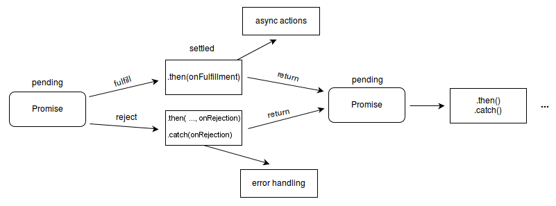

# Fetch API & CORS


**Fetch API**는 네트워크 통신을 포함한 리소스 취득을 위한 인터페이스가 정의되어 있습니다. [`XMLHttpRequest`](https://developer.mozilla.org/ko/docs/Web/API/XMLHttpRequest)와 같은 비슷한 API가 존재합니다만, 새로운 Fetch API는 좀더 강력하고 유연한 조작이 가능합니다.


#### Fetch API는 반환값으로 Promise(response를 담아서)를 응답 해주므로, 아래와 같이 간단히 구현 해볼수있다.

```javascript
// fetch 예제 
codefetch('http://example.com/movies.json')
  .then((response) => response.json())
  .then((data) => console.log(data));
```

#### 여기서 Promise란 ?


`Promise`는 프로미스가 생성된 시점에는 알려지지 않았을 수도 있는 값을 위한 대리자로, 비동기 연산이 종료된 이후에 결과 값과 실패 사유를 처리하기 위한 처리기를 연결할 수 있습니다. 프로미스를 사용하면 비동기 메서드에서 마치 동기 메서드처럼 값을 반환할 수 있습니다. 다만 최종 결과를 반환하는 것이 아니고, 미래의 어떤 시점에 결과를 제공하겠다는 '약속'(프로미스)을 반환합니다. -MDN-\


`Promise`는 다음 중 하나의 상태를 가집니다.

* 대기(_pending)_: 이행하지도, 거부하지도 않은 초기 상태.
* 이행(_fulfilled)_: 연산이 성공적으로 완료됨.
* 거부(_rejected)_: 연산이 실패함.


<figure><figcaption><p>출처 MDN</p></figcaption></figure>

#### 관련된 ReableStream의 설명에서도 Fetch API에 대하여 나온다


[Fetch API](https://developer.mozilla.org/ko/docs/Web/API/Fetch\_API) 는 네트워크를 통해 리소스를 가져오는 [XHR](https://developer.mozilla.org/ko/docs/Web/API/XMLHttpRequest)의 현대적인 대안책 입니다. Fetch API의 수많은 이점 가운데 가장 훌륭한점은 최근 브라우저들이 Fetch Response를 Readable 스트림으로 이용할수 있게 하는 기능을 추가한것 입니다.\
[Streams API](https://developer.mozilla.org/ko/docs/Web/API/Streams\_API)의 `ReadableStream` 인터페이스는 바이트 데이터를 읽을수 있는 스트림을 제공합니다


쉽게 이해하자면, ReableStream은 데이터를 다 읽어올 때까지  진행되며, 더 이상 읽어올 데이터가 없을 때 브라우저에 데이터 전달이 끝났다고 전달한다.


#### CORS (Cross-Origin Resource Sharing) 교차 출처 리소스 공유


**교차 출처 리소스 공유**(Cross-Origin Resource Sharing, [CORS](https://developer.mozilla.org/ko/docs/Glossary/CORS))는 추가 [HTTP](https://developer.mozilla.org/ko/docs/Glossary/HTTP) 헤더를 사용하여, 한 [출처](https://developer.mozilla.org/ko/docs/Glossary/Origin)에서 실행 중인 웹 애플리케이션이 다른 출처의 선택한 자원에 접근할 수 있는 권한을 부여하도록 브라우저에 알려주는 체제입니다. 웹 애플리케이션은 리소스가 자신의 출처(도메인, 프로토콜, 포트)와 다를 때 교차 출처 HTTP 요청을 실행합니다.


서버에 요청하고 응답을 받아오는 것까지는 이미 진행이 다 된 상황이지만, 브라우저상에서 에러로 처리해버린다.

_간단하게 REST API 서버에서 Headers에 “Access-Control-Allow-Origin” 속성을 추가해주면 되지만, 개발하는 동안 문제가 발생하면 CORS 크롬확장프로그램으로 대체하여 서버 설정이 될때까지 사용한적이 있다._


